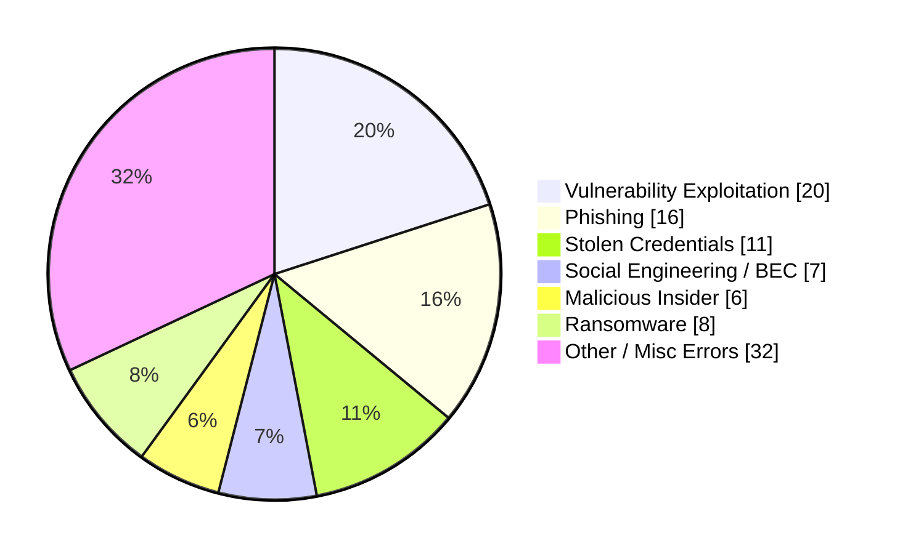
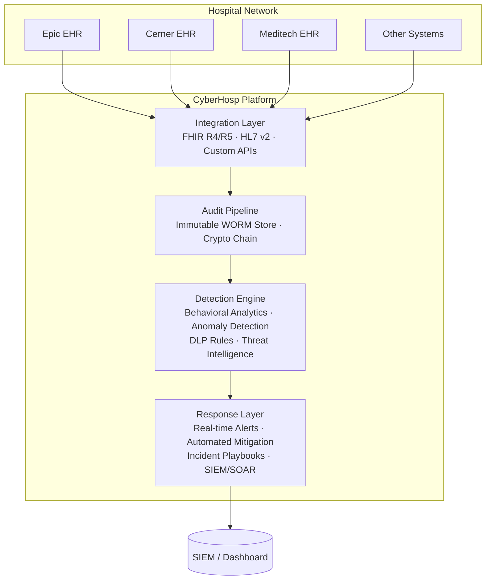

# CyberHosp

[](https://github.com/dhedhialy/cyberhosp/actions/workflows/ci.yml)
[](LICENSE)
[](pyproject.toml)
[](https://github.com/astral-sh/ruff)

**CyberHosp** is a unified, secure-by-default cybersecurity platform that integrates directly into existing hospital EHR systems — not as a bolt-on, but as a hardened, purpose-built layer. It prevents data leakage, kills insider threats, detects ransomware before it encrypts, and automates HIPAA compliance.

---

## The Problem

### Healthcare is bleeding data — $10.93M per breach, 14 years running.[1]

| Metric | Value |
|--------|-------|
| Average cost of a healthcare data breach | **$10.93M** — highest of any industry [1] |
| Largest breach in history (Change Healthcare, 2024) | **~192.7M** individuals affected [2] |
| Worst year on record (2024) | **725 large breaches**, ~289M records exposed [5] |
| Time to identify + contain a breach | **279 days** avg (vs 241 cross-industry) [1] |
| Breaches involving insiders | **30%** (vs 17% cross-industry) [3] |
| Cumulative individuals affected since 2009 | **935.5M** — 2.6× the US population [2] |
| Increase in patient mortality during active ransomware | **33%** (42–67 preventable deaths per event) [6] |
| HIPAA complaints filed since 2003 | **374,322** [8] |
| OCR settlements in 2025 alone | **21** actions, $6.6M+ in fines [8][12] |

### What causes breaches


*Sources: Verizon DBIR 2026, IBM Cost of a Data Breach 2025*

### Why every existing solution misses the real target

Current tools guard the perimeter, the network, and the endpoint. Every single one has the same blind spot:

| Solution | What it monitors | What it misses | Why attackers laugh |
|----------|-----------------|----------------|-------------------|
| **SIEM** (Splunk, QRadar) | Network logs, system events | EHR audit streams, FHIR API calls | "Attacker has valid creds → no alert. Traffic is encrypted → no alert. Query looks normal → no alert." |
| **EHR vendors** (Epic, Cerner) | Their own audit log | Cross-system data flows, API scraping | "I have a legitimate nursing role and 8 hours. I can paginate through every patient record. Epic logs it. Nobody reviews it." |
| **DLP** (CrowdStrike, Symantec) | Endpoint file transfers, USB, print | EHR API exfiltration, FHIR bulk exports | "I don't touch the endpoint. I use the patient API from a cloud VM. DLP never sees me." |
| **IoT security** (Cynerio, Medigate) | Medical device network behavior | Data inside the EHR at rest or in motion | "I compromised the VPN, not an infusion pump. Your device security is irrelevant." |
| **Zero Trust** (Illumio, Zscaler) | Network segmentation, lateral movement | Data exfiltration over approved channels | "Port 443 to `api.ehr.hospital.org` is allowed traffic. I exfiltrate over TLS. Your segmentation sees 'normal.'" |

**The thread through every backdoor:** all existing tools monitor the infrastructure *around* the data, not the data itself. None of them understand patient records, clinical context, or what normal EHR access looks like. An attacker with valid credentials is invisible to every tool in the stack.

### Key backdoors attackers walk through

| Vector | Real-World Example |
|--------|-------------------|
| Unpatched VPN gateways without MFA | Change Healthcare 2024 — 192.7M records [11] |
| Exposed FHIR APIs — no auth, SSRF | CVE-2026-34361 — CVSS 9.3 in HAPI FHIR [10] |
| Third-party vendor cascade | Oracle Health/Cerner breach Jan 2025 — attacker accessed legacy systems, cascaded to hospitals [3] |
| Legacy HL7 — no encryption, no auth | Flat-file MLLP drops exposed on internal subnets [11] |
| Insider abuse — legitimate creds, malicious use | 30% of all healthcare breaches [3] |
| MFA bypass — AiTM proxy sites | Session token theft in real time, 2024–2025 campaigns [3] |

---

## The Gap — What Everyone Else Misses

**No existing product monitors the EHR data-access layer after authentication.** The moment a user enters valid credentials, every security tool in the hospital goes silent. The attacker is now indistinguishable from a doctor doing their job.

CyberHosp is the **first platform that monitors PHI access itself** — not the network around it, not the endpoint holding it, not the device touching it. The *data layer*.

| What existing tools do | What CyberHosp does |
|----------------------|-------------------|
| Monitor network traffic | Monitor EHR audit streams — who accessed what patient record, when, from where |
| Parse syslogs | Parse FHIR R4/R5 and HL7 v2 natively — understand clinical semantics |
| Alert on malware signatures | Alert on behavioral anomalies — a nurse viewing 200 patients in 5 minutes is not a virus, but it is a breach |
| Block known bad IPs | Block API scraping patterns — paginating through `/Patient?page=1` through `/Patient?page=500` |
| Compliance reports after a breach | Immutable cryptographic audit chain — evidence tamper-proof before, during, and after incident |
| License per seat, features behind paywall | AGPL v3 — every line open, auditable by any hospital security team |

---

### The development pipeline — simulated on Apple Silicon

```
M5 Mac simulation → Validation → Production
```

We develop and test against a simulated hospital environment running entirely on a Mac with Apple Silicon:

- **HAPI FHIR server** — the most deployed open-source FHIR implementation, runs natively on ARM64
- **Synthea** — generates realistic synthetic patient data (10,000+ patients with full records)
- **Mirth Connect** — HL7 v2 interface engine, runs in Docker
- **Simulated Epic/Cerner audit streams** — FHIR audit event generators that replay real breach patterns
- **Attack simulation** — automated scripts that execute the same TTPs used in real healthcare breaches (MITRE ATT&CK for Healthcare)

No production EHR is used in development. Every attack, detection, and response is tested deterministically on synthetic data. The same Docker Compose setup that runs on an M5 Mac is the setup deployed in production.

---

## Platform Architecture



### Core Components

| Component | Description |
|-----------|-------------|
| **Integration Layer** | FHIR R4/R5 + HL7 v2 adapters. Plugs into existing EHR data streams. Read-only — never writes to clinical systems. |
| **Audit Pipeline** | Immutable, append-only log of every PHI access. Write-ahead, cryptographic chain, WORM storage. Tamper-evident by design. |
| **Detection Engine** | Behavioral baselines per user/role/department. Anomaly detection on access patterns, data volume, time-of-day, geolocation. DLP rules in clinical terms. |
| **Response Layer** | Real-time alerts, automated session termination, SIEM forwarding (Splunk/ELK/Sentinel), incident playbooks. |
| **Dashboard** | Security posture, active threats, compliance status, audit trail explorer, auditor-ready reports. |

---

---

## Validation — Compromised Credential Scenario

The first attack scenario has been simulated end-to-end against the detection engine. The results confirm all three behavioral indicators fire correctly on the compromised credential misuse pattern while producing zero false positives on normal behavior.

### Scenario

An attacker phishes nurse Valdez's credentials, waits 8 days (bypassing physics-based impossible-travel detection), then logs in from Moscow at 3 AM and paginates through 187 patient records in 32 minutes across Cardiology and Neurology.

### Simulation output

```
[PHASE 1] Normal login — baseline
  ✓ Normal login: no alert (correct)

[PHASE 2] Normal patient access — 10 records
  ✓ 10 patient accesses: no alert (correct)

[PHASE 3] ATTACKER LOGIN — Moscow, 03:14 AM
  ⚠ ALERT: [HIGH] UNFAMILIAR_LOCATION

[PHASE 4] ATTACKER ACCESS — 187 records in 32 minutes
  ⚠ ALERT: [MEDIUM] OFF_HOURS_ACCESS
    Hour: 3:00, weekday: 6
    Baseline hours: 7:00-19:00
  ⚠ ALERT: [HIGH] MASS_RECORD_ACCESS
    50 patients in 5.0min
    Rate: 10.0 patients/min (threshold: 50)
```

### Indicators validated

| Indicator | Trigger | Why it catches this attack |
|-----------|---------|---------------------------|
| **Location Anomaly** | First-time login from a high-risk country (RU) | Nurse Valdez has never logged in from Moscow before |
| **Off-Hours Access** | Access outside 7 AM–7 PM baseline | 3 AM is outside any clinical role's normal hours |
| **Mass Record Access** | 50+ unique patients in a 5-minute sliding window | Paginating through unrelated patients across departments is not clinical work |

### Detection design notes

- **Impossible travel (physics) intentionally silent** — the attacker waited 8 days between logins, which is sufficient for commercial flight. Sophisticated attackers pace themselves. The location-anomaly + off-hours + mass-access triad catches them without relying on speed-of-light calculations.
- **Alerts are deduplicated** — each detector fires once per user per window, preventing alert flood. The 200-record burst produces 4 total alerts (1 location anomaly, 1 off-hours, 2 mass-access across sliding windows).
- **Zero false positives** — 10 normal patient accesses and a normal login from Chicago produce no alerts.

---

## Development Roadmap

### Phase 1 — Simulated Hospital (Current)
- [x] Problem research, evidence, competitive analysis
- [x] Architecture and infrastructure
- [x] Detection engine — mass access, off-hours, location anomaly, impossible travel
- [x] Attack simulation — compromised credential scenario validated
- [ ] HAPI FHIR server deployment on M5 Mac
- [ ] Synthea synthetic patient data generation
- [ ] FHIR audit event stream simulator

### Phase 2 — Core Engine
- [ ] Immutable audit pipeline with crypto chain
- [ ] Behavioral baseline engine
- [ ] DLP rules engine — clinical pattern matching
- [ ] Real-time alert dispatcher

### Phase 3 — Hardening
- [ ] SSRF protection at FHIR proxy
- [ ] Rate limiting and API abuse detection
- [ ] Ransomware early warning

### Phase 4 — Release
- [ ] Dashboard and reporting
- [ ] SIEM integration (Splunk, ELK)
- [ ] Full documentation
- [ ] Penetration testing
- [ ] Production release

---

## Quick Start

```bash
git clone https://github.com/dhedhialy/cyberhosp.git
cd cyberhosp
pip install -e ".[dev]"
```

*Full simulation environment setup guide coming next — this is where I need your input (see below).*

---

## Project Status

**Active development** on Apple Silicon (M5 Mac). Detection engine validated against the compromised credential scenario (3 of 3 indicators fire, 0 false positives). Simulated hospital environment with HAPI FHIR + Synthea next.

---

## License

AGPL v3 — See [LICENSE](LICENSE) for details.

---

## References

1. [IBM Cost of a Data Breach Report 2025](https://www.ibm.com/reports/data-breach)
2. [HHS OCR Breach Portal](https://ocrportal.hhs.gov/ocr/breach/breach_report.jsf)
3. [Verizon Data Breach Investigations Report 2026](https://www.verizon.com/business/resources/reports/dbir/)
4. [AHA 2026 Environmental Scan](https://www.aha.org/environmentalscan)
5. [HIPAA Journal — 2024 Healthcare Data Breach Report](https://www.hipaajournal.com/2024-healthcare-data-breach-report/)
6. [Axis Intelligence — Healthcare Data Breach Statistics 2026](https://axis-intelligence.com/healthcare-data-breach-statistics)
7. [Sprinto — Data Breach Statistics 2026](https://sprinto.com/blog/statistics/data-breach)
8. [HHS HIPAA Enforcement Highlights](https://www.hhs.gov/hipaa/for-professionals/compliance-enforcement/data/enforcement-highlights/index.html)
9. [HIPAA Security Rule NPRM (2024)](https://www.federalregister.gov/documents/2024/12/27/2024-30983/hipaa-security-rule-to-strengthen-the-cybersecurity-of-electronic-protected-health-information)
10. [Prophaze — SSRF Attacks on EHR Integration APIs](https://www.prophaze.com/ssrf-attacks-ehr-integration-apis-blind-spot-in-healthcare)
11. [Microsoft — US Healthcare: Strengthening Against Ransomware](https://www.microsoft.com/en-us/security/security-insider/threat-landscape/us-healthcare-at-risk-strengthening-resiliency-against-ransomware-attacks)
12. [One Guy Consulting — $6.6M in HIPAA Fines: 2025 Breakdown](https://oneguyconsulting.com/blog/hipaa-fines-2025-breakdown)
