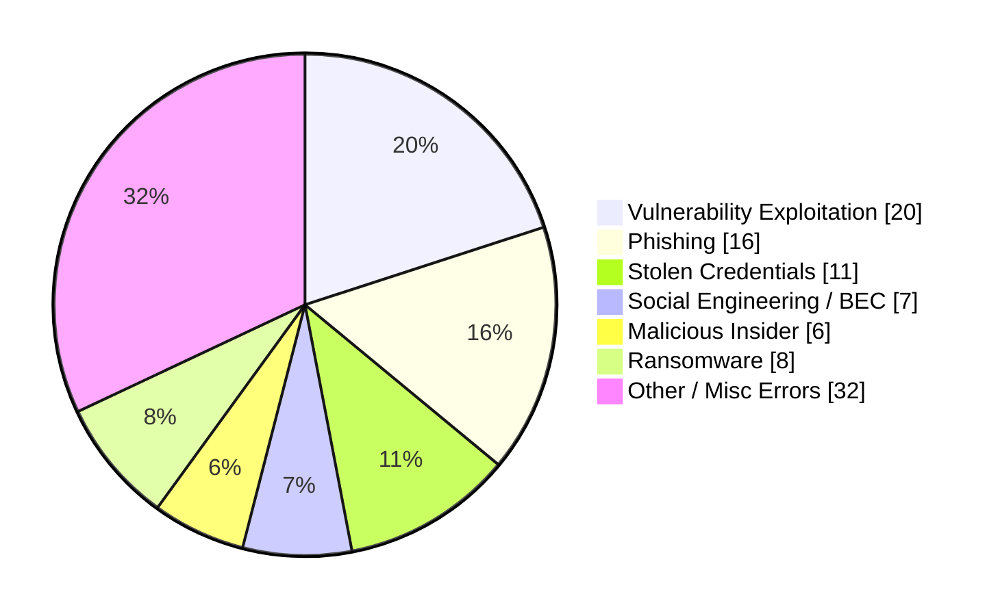
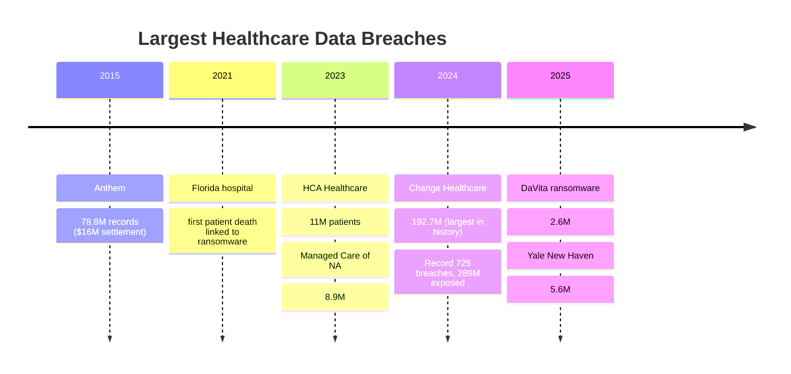
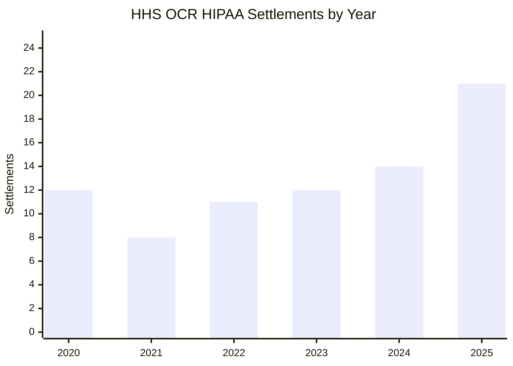
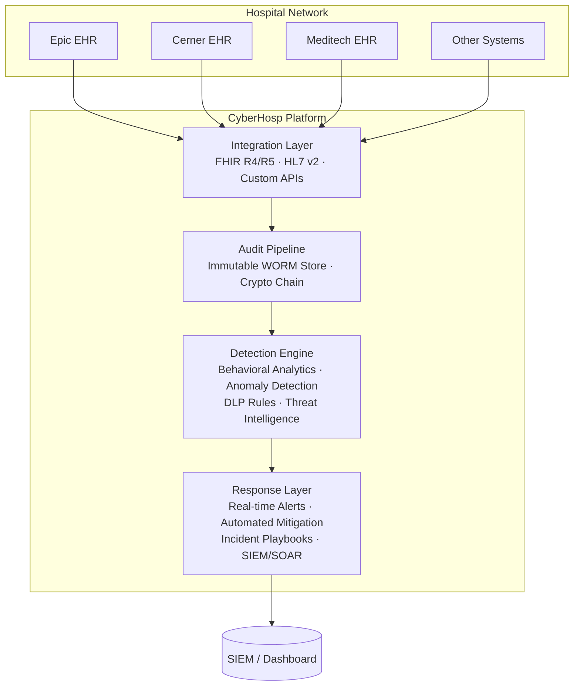

# CyberHosp — EHR-Integrated Healthcare Cybersecurity Platform

[](LICENSE)
[](pyproject.toml)
[](https://github.com/astral-sh/ruff)

**CyberHosp** is an industry-grade cybersecurity platform that integrates directly into existing hospital Electronic Health Record (EHR) systems to prevent data leakage, detect insider threats, stop ransomware before it spreads, and automate HIPAA compliance — all without disrupting clinical workflows.

---

## The Problem

Healthcare is the most attacked industry on the planet — **14 years running**.[1]

| Metric | Value |
|--------|-------|
| Average cost of a healthcare data breach (2025) | **$7.42M** — highest of any industry [1] |
| Average cost in the US specifically | **$9.8M** per breach [4] |
| Largest breach in history (Change Healthcare, 2024) | **~192.7M** individuals affected [2] |
| Worst year on record (2024) | **725 large breaches**, ~289M records exposed [5] |
| Time to identify + contain a breach | **279 days** avg (vs 241 cross-industry) [1] |
| Breaches involving insiders (malicious or negligent) | **30%** of all healthcare breaches (vs 17% cross-industry) [3] |
| Organizations attacked at least once in 12 months | **93%** [6] |
| Increase in patient mortality during active ransomware | **33%** increase (42–67 preventable deaths per event) [6] |
| HIPAA complaints filed since 2003 | **374,322** [8] |
| OCR settlements in 2025 alone | **21** actions, $6.6M+ in fines [8][12] |
| Cumulative individuals affected by healthcare breaches since 2009 | **935.5M** — 2.6× the US population [2] |

### What causes healthcare breaches


*Sources: [3] Verizon DBIR 2026, [1] IBM Cost of a Data Breach 2025*

### Breach cost by industry — healthcare leads by a wide margin

| Industry | Avg Breach Cost (2025) | vs Healthcare |
|----------|----------------------|--------------|
| **Healthcare** | **$10.93M** | — |
| Financial | $5.90M | 46% less |
| Technology | $4.50M | 59% less |
| Energy | $4.80M | 56% less |
| Pharmaceuticals | $5.05M | 54% less |
| Industrial | $4.65M | 57% less |
| Retail | $2.96M | 73% less |
| Education | $3.40M | 69% less |
*Sources: [1] IBM Cost of a Data Breach 2025, [7] Sprinto Data Breach Statistics 2026*

### Breach trend — 2024 was the worst year on record

| Year | Large Breaches (500+ records) | Individuals Affected |
|------|------------------------------|---------------------|
| 2020 | 642 | ~27M |
| 2021 | 714 | ~40M |
| 2022 | 707 | ~52M |
| 2023 | 716 | ~133M |
| 2024 | **725** | **~289M** |
| 2025 | — | ~61.6M |
*Sources: [2] HHS OCR Breach Portal, [5] HIPAA Journal 2024 Healthcare Data Breach Report*

### Major breach timeline



### Why healthcare is uniquely vulnerable

- **EHRs are treasure troves:** A single patient record contains SSN, insurance, billing, diagnosis, medications, and biometrics — worth 10–50× a credit card number on the black market.[11]
- **Legacy infrastructure:** Many hospitals run unpatched systems, outdated EHR versions, and fragmented IT stacks.[11]
- **Lifesaving urgency creates openings:** Attackers know hospitals will pay ransoms to avoid patient care disruption. 64% of ransomware victims experienced delayed procedures; 59% reported longer patient stays.[6]
- **Massive attack surface:** Modern hospitals integrate 200+ vendors — lab systems, billing, telehealth, patient portals, pharmacy, imaging — each a potential entry point.[11]
- **API exposure is exploding:** FHIR-based APIs, while essential for interoperability, introduce SSRF, auth bypass, and data exfiltration vectors (CVE-2026-34360, CVE-2026-34361 in HAPI FHIR scored CVSS 9.3).[10]
- **Insider risk is structural:** 30% of healthcare breaches involve insiders — high staff turnover, broad legitimate access to PHI, and data movement between providers make this a permanent feature.[3]

### Key backdoors and attack vectors

These are the specific technical weaknesses attackers exploit to breach healthcare systems:

| Vector | Description | Real-World Example |
|--------|-------------|-------------------|
| **Unpatched VPN gateways** | Ransomware groups scan Shodan for exposed, unpatched VPN appliances (Pulse Secure, Citrix, Fortinet) to gain initial foothold | Change Healthcare 2024 — compromised credentials on a remote access gateway without MFA [11] |
| **Exposed FHIR APIs** | Unauthenticated or poorly authenticated FHIR endpoints leak entire patient databases. SSRF in FHIR servers (CVE-2026-34361, CVSS 9.3) allows internal network pivoting | HAPI FHIR `/loadIG` endpoint — no auth, no hostname validation, shipped with incomplete security controls [10] |
| **Legacy HL7 interfaces** | HL7 v2 has no built-in auth or encryption. Flat-file drops and unauthenticated MLLP sockets are common in older hospital networks | Multiple small hospital breaches — HL7 feeds exposed on internal subnets with no segmentation [11] |
| **RDP and remote desktop** | Unsecured RDP on clinical workstations is a top entry for ransomware. Attackers brute-force or buy stolen RDP credentials on dark web | Ryuk/Conti campaigns 2020–2023 — hospitals with RDP exposed to the internet [11] |
| **Third-party vendor access** | Vendors (billing, lab, imaging) get VPN or app-level access to the hospital network. A compromise at one vendor cascades across dozens of hospitals | Managed Care of NA 2023 — 8.9M records via vendor compromise [5] |
| **Phishing-resistant MFA bypass** | Adversary-in-the-middle (AiTM) proxy sites bypass OTP-based MFA in real time, stealing both password and session token | SolarWinds-adjacent healthcare attacks, 2024–2025 [3] |
| **Shadow IT and unsanctioned SaaS** | Clinicians sign up for consumer-grade file sharing, AI tools, or messaging apps — PHI leaks out with no audit trail | 2025 OCR settlements cite unapproved cloud storage as recurring violation [8] |
| **Medical device network exposure** | Infusion pumps, MRI scanners, and patient monitors run embedded Windows with no patching, flat on the hospital LAN | Stryker network disruption, March 2026 — device management interface breached [10] |

### The data leakage problem

Data leakage in healthcare is distinct from other breach types because it is often **silent, ongoing, and invisible to traditional perimeter defenses**:

- **Insider exfiltration:** A nurse accessing a celebrity patient's chart "just to look" is a privacy violation. A billing clerk exporting 10,000 rows of patient data to a personal spreadsheet is data leakage. Both happen daily and most hospitals catch neither.
- **Accidental exposure:** Misconfigured cloud storage, misaddressed faxes, emails with PHI sent to wrong recipients — these are the majority of small breaches that never make headlines but trigger OCR fines.
- **API scraping:** Legitimate API keys used to paginate through every patient record over hours or days, indistinguishable from normal traffic to the EHR. No alert fires until the data appears on a dark web forum.
- **Third-party data bleed:** Every integration with a lab, pharmacy, billing service, or population health platform is a pipe through which PHI flows. Most hospitals have no visibility into what data leaves via these pipes.
- **Device data spillage:** Medical devices generate and transmit PHI (patient name, DOB, measurement data) over unencrypted protocols. A compromised device on the same subnet can silently siphon this data.

The common thread: **data leakage is a visibility problem first, a policy problem second.** You cannot prevent what you cannot see.

### The regulatory landscape is tightening

- **HIPAA Security Rule NPRM (2024):** Turns "addressable" safeguards into requirements — mandatory encryption, MFA, asset inventories, vulnerability scans every 6 months, pen tests annually.[9]
- **OCR audits resumed (Dec 2024):** Active enforcement is accelerating — 21 settlements in 2025, OCR's second-highest annual total.[8]
- **State laws going beyond HIPAA:** Washington's My Health My Data Act, California CPRA, Texas DPSA — all impose stricter requirements on health data.[9]
- **New York hospitals:** Must report cyberattacks to the State Dept of Health within 72 hours.[9]
- **HIPAA penalty caps:** Up to $2.13M annually per violation tier; criminal penalties up to $250K and 10 years imprisonment.[8]

### The gap CyberHosp fills

Existing solutions are fragmented:
- **SIEMs** collect logs but don't understand EHR data models or clinical workflows.
- **EHR vendor security features** are basic audit logs with no behavioral analytics.
- **DLP point solutions** generate false positives that desensitize security teams.
- **Compliance tools** are checkbox exercises, not runtime enforcement.

**CyberHosp bridges clinical and security domains** — it speaks FHIR/HL7, understands PHI context, detects anomalies at the data-access level, and enforces policy at the API gateway in real time.

### Regulatory heat map — penalty exposure is accelerating


*Source: HHS OCR Enforcement Highlights, One Guy Consulting HIPAA Fine Analysis 2025*

---

## Our Approach

CyberHosp is built on a single principle: **stop the bleed by seeing the flow.** Every PHI access generates a signal — we collect, analyze, and act on those signals in real time.

| Principle | What it means |
|-----------|--------------|
| **Read-only by design** | All monitoring is passive. We observe EHR audit streams, write nothing back to clinical systems, and introduce zero latency to patient care workflows. |
| **Context-aware detection** | We understand the difference between a nurse accessing their assigned patients' charts and the same nurse accessing 200 unrelated records in 5 minutes. Rules are expressed in clinical terms, not raw logs. |
| **Defense in depth at the data layer** | Security at the network perimeter is necessary but insufficient — once an attacker has valid credentials, perimeter controls are blind. We monitor at the EHR data-access layer, where the actual PHI lives. |
| **Open-core, community-auditable** | The platform is AGPL v3. Every line of code is open for inspection by hospital security teams, pen testers, and researchers. Security through transparency, not obscurity. |
| **Built for the homelab, hardened for production** | We develop and test against simulated hospital environments first — the same stack a security researcher runs on their laptop at home is the stack deployed in production. |

### Why build this in a homelab?

A hospital's production EHR is the wrong place to develop and test security tools. A homelab is the right place:

1. **Safety.** You can simulate ransomware, data exfiltration, and insider abuse without risking real patient data or triggering a code blue. Mistakes in a homelab are learning opportunities, not HIPAA violations.
2. **Fidelity.** A proper homelab running FHIR servers (HAPI FHIR, InterSystems IRIS community edition), HL7 engines (Mirth Connect), and realistic synthetic patient data (Synthea) behaves like a real hospital network. If it works here, it works there.
3. **Reproducibility.** Every attack, defense, and detection rule can be tested, broken, fixed, and re-tested deterministically. No dependence on production traffic patterns or adversary behavior you cannot control.
4. **Skill development.** Hospital security teams need hands-on experience with EHR-specific threats — FHIR API abuse, HL7 injection, audit log tampering, medical device network exploits. A homelab is the only safe place to build these skills.
5. **Penetration testing readiness.** Before CyberHosp ever touches a real hospital network, it will be tested against realistic homelab environments — the same setup described in this repo. When you pen test it, you are testing what was forged in the same fire.

The CyberHosp development loop:
```
Homelab (develop + break) → Staging (validate + tune) → Production (monitor + protect)
```

---



### Core Components

| Component | Description |
|-----------|-------------|
| **Integration Layer** | FHIR R4/R5 and HL7 v2 adapters for major EHR platforms (Epic, Cerner, Meditech, athenahealth). Plugs into existing data streams via SMART-on-FHIR and HL7 interfaces. |
| **Audit Pipeline** | Immutable, append-only audit log capturing every PHI access — who, what, when, which record, from where. Write-once-read-many (WORM) storage with cryptographic chaining. |
| **Detection Engine** | Behavioral baselines per user/role/department; anomaly detection on access patterns, data volume, time-of-day, geolocation; ML models for insider threat scoring; DLP rules for sensitive data patterns (SSN, DOB, diagnosis codes). |
| **Response Layer** | Real-time alerts to security teams, automated session termination on critical violations, SIEM integration (Splunk, ELK, Sentinel), incident playbook automation. |
| **Dashboard** | Security posture overview, active threat map, compliance status, audit trail explorer, report generation for auditors. |

### Supported EHR Integrations

- Epic (via FHIR R4 + HL7 v2)
- Oracle Cerner (via FHIR R4 + HL7 v2)
- Meditech (via HL7 v2 + Web API)
- athenahealth (via FHIR R4 API)
- InterSystems HealthShare (via FHIR R4)
- Custom EHRs via FHIR R4/R5 or HL7 v2

---

## Key Capabilities

### 1. Real-Time Data Leakage Prevention
- Monitor all outbound EHR data flows (API calls, file exports, print, clipboard)
- Detect mass record access / bulk exports indicative of exfiltration
- Pattern-match PHI in transit (credit cards, SSNs, medical record numbers)
- Block or flag anomalous outbound transfers

### 2. Insider Threat Detection
- Behavioral baselines per role (nurse, doctor, admin, billing)
- Alert on after-hours access, unusual record volumes, cross-department queries
- Track privilege escalation and lateral movement within EHR
- Identify compromised credentials via impossible-travel detection

### 3. Ransomware Early Warning
- Monitor for mass file encryption patterns, rapid file rename/modify events
- Detect credential harvesting (unusual failed login bursts)
- Alert on unauthorized backup/deletion attempts
- Trigger automated network segmentation on confirmed indicators

### 4. HIPAA Compliance Automation
- Continuous control monitoring mapped to HIPAA Security Rule
- Automated evidence collection for audits
- Built-in risk assessment workflows
- Breach notification timeline tracking
- Policy distribution and attestation

### 5. FHIR API Security
- API gateway with rate limiting, auth enforcement, and payload inspection
- SSRF protection at the FHIR proxy layer
- OAuth2 / SMART-on-FHIR compliance
- API abuse detection (excessive queries, scraping attempts)

---

## Quick Start

```bash
# Clone the repository
git clone https://github.com/dhedhialy/cyberhosp.git
cd cyberhosp

# Install dependencies
pip install -e ".[dev]"

# Run initial configuration
cyberhosp init

# Start the platform
cyberhosp start
```

*Full installation and deployment guides coming soon.*

---

## Project Status

CyberHosp is in **active development**. The platform is being built toward an industry-grade release with the following roadmap:

- ✅ Problem research & evidence compilation
- 🔄 Core architecture & repo infrastructure
- ⬜ Integration layer (FHIR/HL7 adapters)
- ⬜ Audit pipeline & immutable logging
- ⬜ Detection engine & DLP rules
- ⬜ Alerting & incident response
- ⬜ Dashboard & reporting
- ⬜ Penetration testing & hardening
- ⬜ Production release

---

## License

AGPL v3 — See [LICENSE](LICENSE) for details.

---

## References

1. [IBM Cost of a Data Breach Report 2025](https://www.ibm.com/reports/data-breach) — Healthcare ranked costliest industry for 14th consecutive year at $7.42M average.
2. [HHS OCR Breach Portal](https://ocrportal.hhs.gov/ocr/breach/breach_report.jsf) — Official US healthcare data breach reporting portal.
3. [Verizon Data Breach Investigations Report 2026](https://www.verizon.com/business/resources/reports/dbir/) — 30% of healthcare breaches involve insiders; vulnerability exploitation top vector at 20%.
4. [AHA 2026 Environmental Scan](https://www.aha.org/environmentalscan) — US healthcare breach costs average $9.8M.
5. [HIPAA Journal — 2024 Healthcare Data Breach Report](https://www.hipaajournal.com/2024-healthcare-data-breach-report/) — 725 large breaches, ~289M records exposed in worst year on record.
6. [Axis Intelligence — Healthcare Data Breach Statistics 2026](https://axis-intelligence.com/healthcare-data-breach-statistics) — 93% orgs attacked, 33% mortality increase during ransomware, 64% delayed procedures.
7. [Sprinto — Data Breach Statistics 2026](https://sprinto.com/blog/statistics/data-breach) — Cross-industry breach cost comparison: healthcare $10.93M vs finance $5.9M.
8. [HHS HIPAA Enforcement Highlights](https://www.hhs.gov/hipaa/for-professionals/compliance-enforcement/data/enforcement-highlights/index.html) — 374,322 complaints since 2003; 21 settlements in 2025.
9. [HIPAA Security Rule NPRM (2024)](https://www.federalregister.gov/documents/2024/12/27/2024-30983/hipaa-security-rule-to-strengthen-the-cybersecurity-of-electronic-protected-health-information) — Proposed rule making encryption, MFA, and regular pen testing mandatory.
10. [Prophaze — SSRF Attacks on EHR Integration APIs](https://www.prophaze.com/ssrf-attacks-ehr-integration-apis-blind-spot-in-healthcare) — CVE-2026-34360/34361 in HAPI FHIR; CVSS 9.3 critical SSRF.
11. [Microsoft — US Healthcare: Strengthening Against Ransomware](https://www.microsoft.com/en-us/security/security-insider/threat-landscape/us-healthcare-at-risk-strengthening-resiliency-against-ransomware-attacks) — Case studies of Change Healthcare, rural hospital impacts, EHR data valuation.
12. [One Guy Consulting — $6.6M in HIPAA Fines: 2025 Breakdown](https://oneguyconsulting.com/blog/hipaa-fines-2025-breakdown) — 21 OCR enforcement actions in 2025 with per-case analysis.
